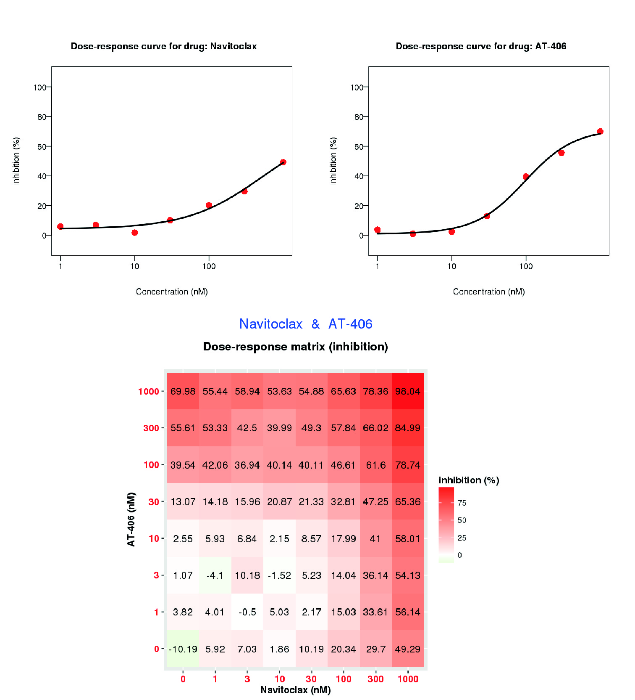
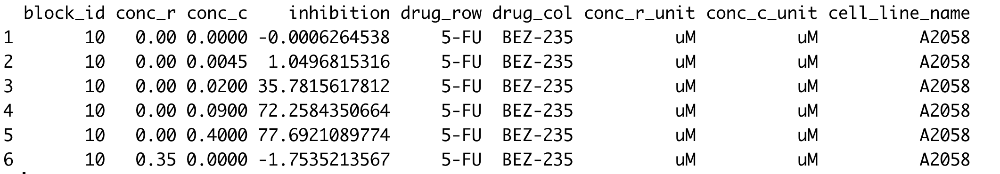

This is part II of analysis of drug dose-response data, where we look at *combinatorial* drug dose-response experiments. For *single* drug dose-response data analysis and introduction of basic concepts on measures of drug efficacy, go to my post on [drug dose-response data analysis](../post-single-dose-response-data-analysis).
 
Even though there are many anticancer drugs available in the market, cancer is still one of the deadliest diseases in the world. One of the reasons for this is that cancer is a complex disease, affecting several redundant pathways or mechanisms in a cell to achieve the same result (over-production of cells). However, most anticancer drugs are designed to target only one or a few cancer-causing gene mutations. Because of this, even if a drug is designed to target a highly relevant gene(s), mutations in other (redundant) genes can reactivate the growth of cancer cells (this leads to what sometimes is referred to as a ‘drug-resistant’ cancer). 

One way to address this is to provide drug combinations, with each drug targeting a different but redundant cancer-causing mechanism, for example, different genes involved in the same biological mechanism. So, how do we know if a drug combination works better than each drug individually? Because we’re talking about drugs given to patients, before being used as therapies, each drug combination would need to be tested through clinical trials. But clinical trials are expensive and can take several years, so there’s no way we can have clinical trials for all the hundreds of potential anticancer drug combinations. To prioritize the most promising drugs and drug combinations, researchers test drug combinations’ effects in cell cultures with dose-response studies.

In *single* drug dose-response studies, we have cancerous cell cultures to which a drug is administered in increasing concentration. For each of drug concentrations, the inhibition of cell growth is measured. The higher the inhibition of cell measured, the more effective the drug is. Combinatorial drug dose-response studies are similar to the single drug studies. The only difference is that 2 drugs (or N drugs) are administered in varying concentrations, instead of just one drug. 

We can observe the difference in output of experiments for single and combinatorial studies in the next figure:


Here, we have drugs Navitoclax and AT-406. Single drug experiments produce a measure of cell growth inhibition for each concentration of the drug that is administered. Combinatorial experiments produce a measure of cell growth inhibition for each combination of concentrations of the drugs being administered. 

Efficacy of a drug combination is measured by comparing the measured effect of the drug combination vs the expected effect of the drugs if they did not interact with each other. This is usually represented by a measure of *synergism*, which tests whether the effect produced by the drugs acting together is greater than what would be expected if they did not interact with each other. Different models have been developed to compute drug synergism based on different assumptions about the expected effect of non-interaction:

- **Loewe Model:**
- **Bliss Model:**
- **HSA Model:**
- **Zero Interaction Potency (ZIP) Model:** 


<br>

Now that we know how to measure efficacy of drug combinations, let's go to the data analysis in R step by step.

### Step-by-step data analysis

We will analyze drug combination data taken from [DrugComb](https://drugcomb.fimm.fi) which you can download <a href="toy_drug_combination_data.csv" download>here</a>.

First, we load libraries we will use and load the data:
```
library(drc)
library(ggplot2)
library(magrittr)
library(synergyfinder)
library(Cairo)

data = data.frame(read.csv('toy_drug_combination_data.csv'))
head(data)
```

<br>

The data matrix contains measures of cell growth inhibition at varying concentrations of drug 5-FU (`conc_r`) and drug BEX-235 (`conc_c`). We can fit dose-response curves to individual drugs by subselecting the rows in which `conc_r` or `conc_c` are equal to zero and using the `drm` model from the `drc` package (for more details, check my post on [drug dose-response data analysis](../post-single-dose-response-data-analysis)):

```
##Drug 5-FU
data_row = data[data$conc_c == 0,]
fitted_curve <- drm(formula = inhibition ~ conc_r,
             data = data_row,
             fct = LL.4())
plot(fitted_curve, 
     log='x', 
     xlab = 'Drug concentration (microM)', 
     ylab= 'Inhibition')
```


```
##Drug BEZ-235
data_col = data[data$conc_r == 0,]
fitted_curve <- drm(formula = inhibition ~ conc_c,
                    data = data_col,
                    fct = LL.4())
plot(fitted_curve, 
     log='x', 
     xlab = 'Drug concentration (microM)', 
     ylab= 'Inhibition')
```


Then we measure drug synergism with the package `synergyfinder`:

```
names(data)[names(data) == "inhibition"] <- "response"

data <- ReshapeData(
  data,
  impute = TRUE,
  noise = TRUE, correction = "non", data.type = "inhibition"
)


ZIP <- CalculateSynergy(data, method = "ZIP", adjusted = TRUE)
synergy_score <- mean(ZIP$scores$'10'[ZIP$scores$'10' != 0])
```


