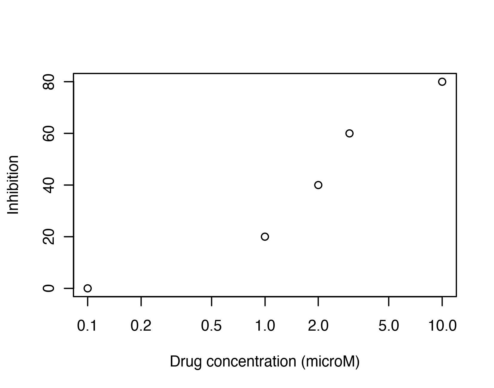
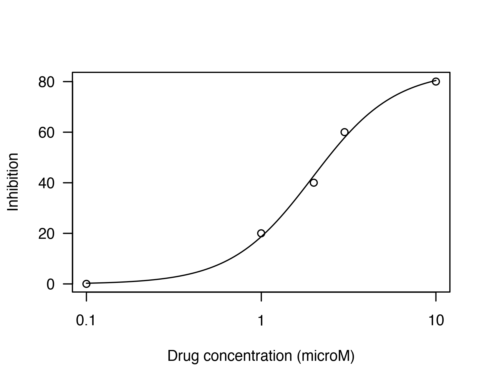
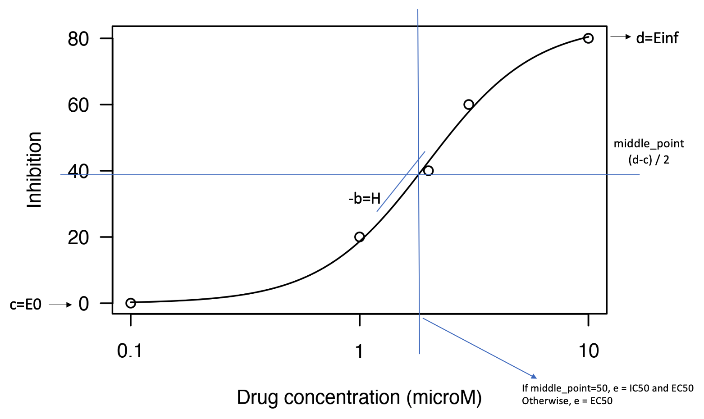
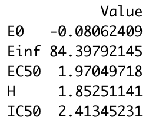

As part of our project on combinatorial therapeutics against covid, I had to process drug dose-response data to derive metrics of drug efficacy to use as features in our neural models. It was surprisingly difficult to find a good blog post on how to analyze this data, and it took me some time to figure out what all the metrics meant and how to obtain them! (Really funny that I understand concepts of machine learning and struggle with this!). In this post, I'll share some background about what drug dose-response studies are and how to analyze raw data generated from these studies.

Drug dose-response studies are experiments carried out to test drug efficacy in cell lines. They are widely used in cancer research to prioritize drugs to be tested in patients. In cancer drugs dose-response studies, we have cultures of cancerous cells to which a drug is administered in increasing concentrations, and the inhibition of cell growth is measured. The higher the inhibition of cells measured, the more effective the drug is against cancer.

Raw data output from these studies looks something like this, where the *x axis* represents the drug concentration and the *y axis* represents the inhibition of cell growth.

 
From this data, several metrics can be extracted to measure drug efficacy:

- **E0**: Response observed in absence of drug
- **Einf**: Maximum response caused by a drug
- **EC50**: Concentration of a drug at which 50% of its maximal response is induced. EC50 is normally measured in molar concentrations and is used as a measure of agonist drug potency - the lower the EC50 value, the lower the concentration of drug required to elicit a 50% maximal response and the greater the potency of the drug.
- **IC50**: Concentration of a drug required for 50% inhibition of cell growth (or, more general, inhibition of any chemical function). It is normally measured in molar concentrations and is used as a measure of antagonist drug potency - the lower the IC50 value, the more potent the drug is. 

With the experimental raw data, we only have a discrete view of what the drug response is. However, we need a continuous representation of the drug-response relationship, so we can obtain a full view of the response caused by the drug at any given concentration. To obtain this continuous view, we need to do a 'curve fitting' procedure. Using a curve fitting algorithm, will adjust the parameters of a curve so that the function 'adjusts' or 'fits' to our data as close as possible. With the adjusted curve, we will be able to interpolate and extrapolate response values, hence we will know the response at any given drug concentration.

A widely-used approach is to fit a 4-parameter logistic curve, defined by the equation:

<br>
<p align="center">

</p>
<br>

A curve-fitting algorithm tries to adjust parameters *b*, *c*, *d*, and *e* so that the curve defined by the equation fits the dose-response data. After fitting the curve to the data, the curve would look something like this: 



Now, let's see what the parameters *b*, *c*, *d*, and *e* mean for the curve. 



Analyzing the curve equation, we see that:
- *c* is the lowest point of the curve - which corresponds to the response observed in absence of drug (**E0**)
- *d* is the highest point of the curve (the value to which the curve converges) - which corresponds to the maximum response of a drug (**Einf**)
- *b* determines the slope of the curve. *-b* is called the 'Hill term' (**H**) and measures how the response changes when the drug concentration increases. A high value of H indicates that the response increases substantially when increasing the drug concentration and viceversa
- If we trace a horizontal line in the middle point of the *y axis* ( (d-c) / 2 ), the drug concentration corresponding to the intersection of the line with the curve is the *e* parameter, i.e., the concentration of a drug at which 50% of its maximal response is induced (**EC50**)
- If the middle point ((d-c) / 2) is equal to 50%, then *e* also corresponds to the **IC50** of the drug. Otherwise, the IC50 can be computed substituting *f(x)* for 50 and finding *x* in the curve equation:

<br>
<p align="center">

</p>
<br>
Now that we know what fitting a curve means and how to obtain metrics of drug efficacy, let's go to the data analysis in R step by step

### Step-by-step data analysis

 First, we load libraries we will use and create synthetic drug dose-response data:
 
```
library(drc)
library(ggplot2)
library(magrittr)
library(synergyfinder)
library(Cairo)

data_synthetic = data.frame(c(0.1,1,2,3,10), c(0,20,40,60, 80))
names(data_synthetic) <- c('concentration', 'inhibition')
```

We plot the raw dose-response data
```
plot(data_synthetic, 
     log='x', 
     xlab = 'Drug concentration (microM)', 
     ylab= 'Inhibition') 
```


Then we fit the curve using the function *drm* from the *drc* package, and plot the fitted curve:

```
fitted_curve <- drm(formula = inhibition ~ concentration,
                    data = data_synthetic,
                    fct = LL.4())
plot(fitted_curve, 
     log='x', 
     xlab = 'Drug concentration (microM)', 
     ylab= 'Inhibition')
```


Now we are ready to obtain the drug efficacy measures:
```
E0 <- fitted_curve$coefficients[2]
Einf <- fitted_curve$coefficients[3]
EC50 <- fitted_curve$coefficients[4]
H <-  -fitted_curve$coefficients[1]
IC50 <- exp(log((((Einf - E0) / (50 - E0) ) - 1) * EC50**(-H))/ (-H))

efficacy_metrics <- data.frame(c(E0, Einf, EC50, H, IC50))
rownames(efficacy_metrics) <- c('E0', 'Einf', 'EC50', 'H', 'IC50')
colnames(efficacy_metrics) <- 'Value'
efficacy_metrics
```


<br>
<br>
And our analysis is done! :D
<br>
<br>


